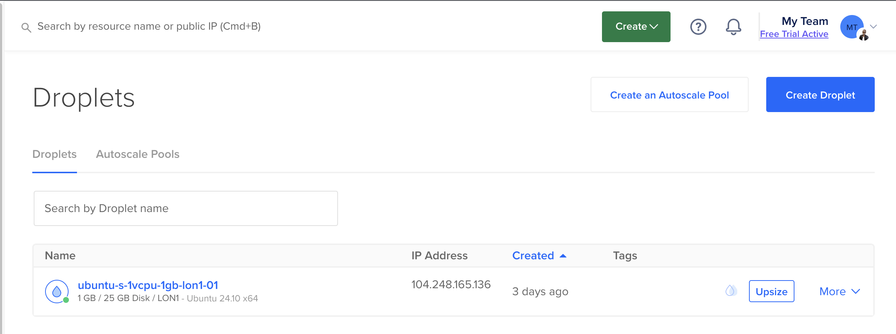
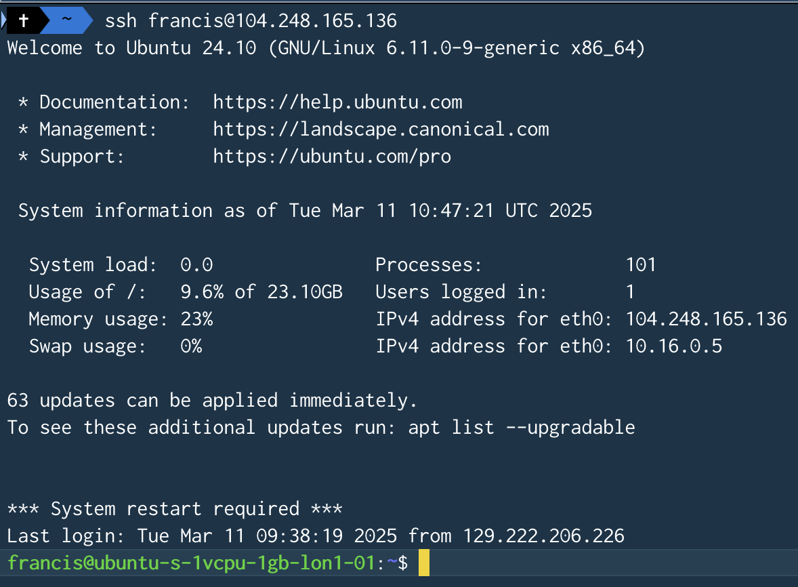
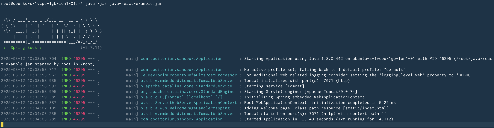
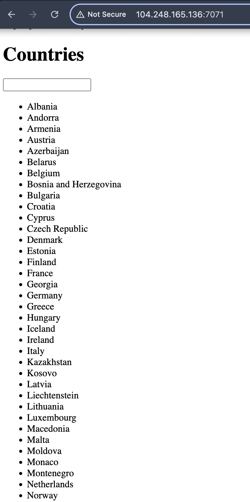

# DevOps Project 01
In this project, I created a server(droplet) and deployed an application on DigitalOcean

### Technologies used:
DigitalOcean, Linux, Java, Gradle
### Completed Tasks:
- Setup and configure a server(droplet) on DigitalOcean

- Created and configured a new Linux user on the Droplet using the terminal 

- Deployed and ran a Java Gradle application on the Server. 

## Application running successfully 

